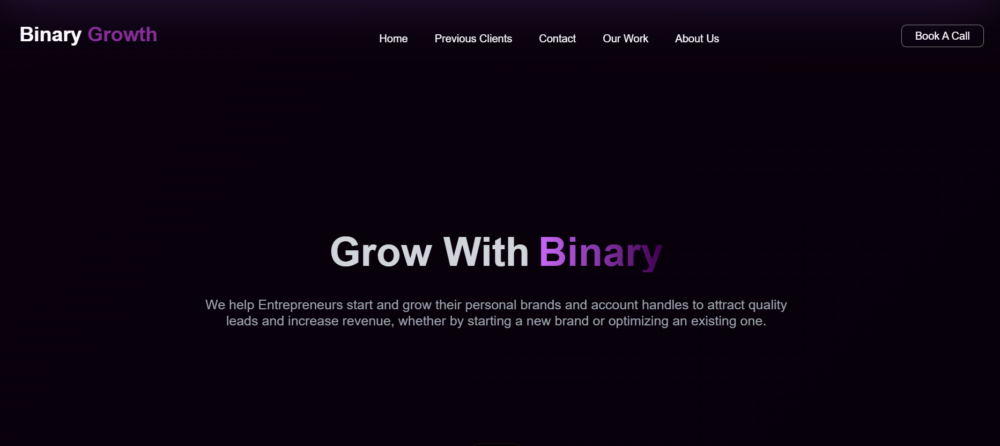

<h1>Website</h1>
This website is built using React+Vite powered by tailwindCSS.<br>
Basically, It comprises of a Landing page for the SMMA Binary Growth.

<h2>About</h2>
<p>With a team of passionate marketers, content creators, and strategists, we ensure every campaign is tailored to resonate with your audience. Whether you're a budding startup or an established brand, we have the tools and expertise to amplify your online presence and set you apart from the competition.<br>Mbr>

Your growth is our priority, and we believe in building lasting partnerships through transparency, innovation, and real results.</p>

Here's a preview to the home page :<br>

<h2>Tech Stack</h2>
Front-end
<ul>
  <li>React</li>
  <li>Vite</li>
  <li>tailwindCSS</li>
</ul>
<br>
<h2>Prerequisites</h2>
Make sure you have Git & node installed on your system.
Verify this by running this on your system : 
```console
git --version
```
```console
node --version
npm --version
```

<h2>Installation</h2>

```console
git clone https://github.com/yobslob/Binary-Growth.git
```

```console
cd Binary-Growth
```

```console
npm install
```

<h2>Local Development</h2>

```console
npm run dev
```
